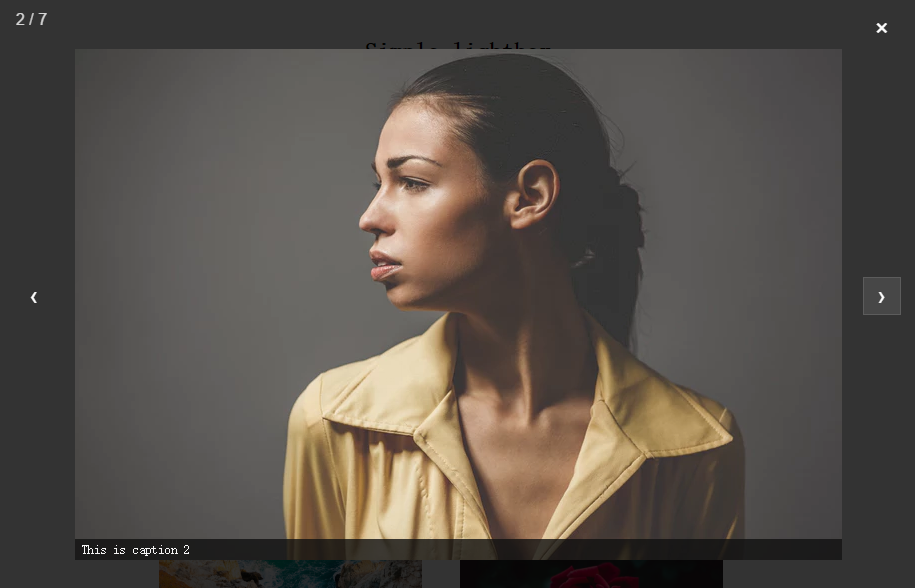

# Simple-lightbox
### 1、Feature
1. 简洁原生`JavaScript`灯箱插件（无需依赖 Jquery）
1. 示例图片来源 [unsplash](https://unsplash.com/)
1. 支持`AMD`&&`CMD`规范

### 2、Install&&Useage
下载文件引入`lightbox.css`和`lightbox.js`文件

```dash
<a href="imgs/image-1.jpg" class="lightbox" title="">
  
</a>
```

###3、DEMO
运行`demo.html`



###4、Configure
|   属性  |   类型  | 默认值 |   描述   |
|--------|-------- |-------|-------- |
|captions| Boolean | true  |是否显示caption|
|captionAttribute| String| "title"  |caption内容来自title|
|nav| String | "auto" |左右控制按钮是否自动获取焦点，否则关闭按钮获得|
|close| Boolean | true  |是否显示关闭按钮|
|counter| Boolean | true  |是否显示计数|
|docClose| Boolean | true  |点击遮罩关闭灯箱|
|swipClose| Boolean | true  |向下滑动关闭灯箱|
|keyboard| Boolean | true  |是否键盘控制|

###5、Supports browser
- IE 10+
- Chrome
- Firefox
- Opera
- Safari